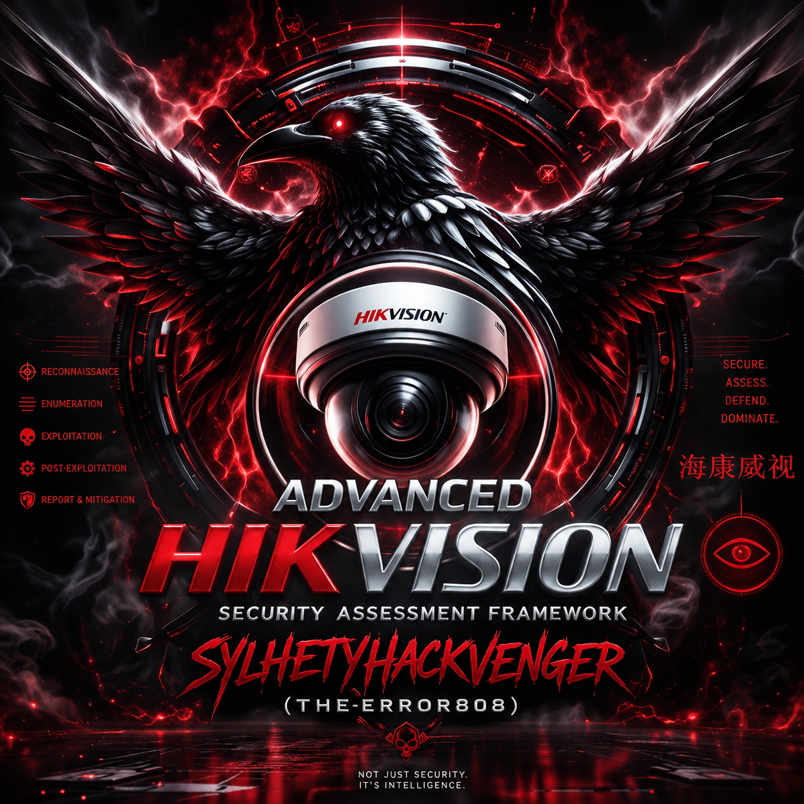
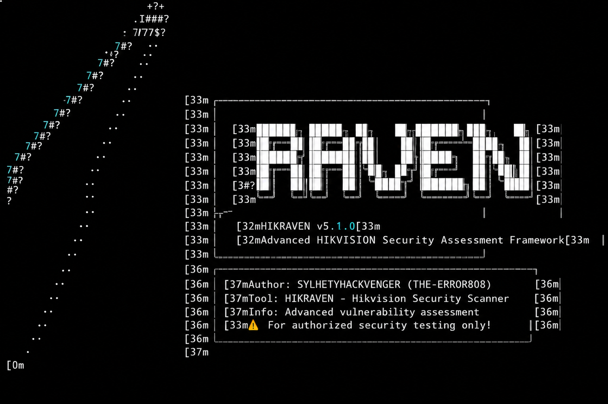

HIKRAVEN 🛡️

<div align="center">


<p align="center">
  
</p>


Advanced Hikvision Security Assessment Platform - Professional Edition

Features • Quick Start • Installation • Usage • Documentation • Disclaimer

</div>

---

⚠️ IMPORTANT LEGAL NOTICE

<div align="center">

[!] THIS TOOL IS FOR AUTHORIZED SECURITY TESTING ONLY [!]

</div>

Unauthorized access to computer systems is illegal and unethical.

By using this tool, you agree to:

· Only test systems you own or have explicit written permission to test
· Comply with all applicable laws and regulations
· Use findings responsibly and report vulnerabilities ethically
· Accept full legal responsibility for your actions

---

📋 Table of Contents

· Overview
· Features
· Installation
· Quick Start
· Usage Guide
· Commands Reference
· Reporting
· Vulnerabilities Detected
· Architecture
· Configuration
· Contributing
· Disclaimer
· License

---

🔍 Overview

HIKRAVEN is a professional-grade security assessment platform specifically designed for identifying and analyzing vulnerabilities in Hikvision devices. Built for security researchers, penetration testers, and IT security professionals, it provides comprehensive network discovery, vulnerability scanning, and reporting capabilities.

Key Capabilities

Capability Description
🔎 Discovery Passive and active network discovery with ARP sniffing, multicast probing, and port scanning
🎯 Fingerprinting Detailed device identification including model, firmware, serial numbers, and cloud status
🛡️ Vulnerability Scan Detection of 12+ known CVEs including critical command injection vulnerabilities
🔑 Credential Testing Automated testing of 40+ default username/password combinations
💥 Exploitation Safe and controlled exploitation testing for authorized penetration testing
📊 Reporting Professional reports in JSON, HTML, CSV, and Markdown formats
🗄️ Database Persistent storage with encryption for credentials and scan history

---

✨ Features

🚀 Discovery & Reconnaissance

· Passive ARP Sniffing - Detect Hikvision devices without active scanning
· Multicast Probing - Discover devices via UDP multicast (239.255.255.250:37020)
· Subnet Scanning - Ping sweeps and port scanning across entire subnets
· MAC OUI Detection - Identify Hikvision devices by MAC address prefixes
· Interface Management - Multi-interface support with cross-platform compatibility
· Reverse DNS - Automatic hostname resolution

🛡️ Vulnerability Assessment

· 12+ CVE Signatures - Comprehensive vulnerability database including:
  · CVE-2021-36260 (Command Injection - CRITICAL)
  · CVE-2017-7923 (Authentication Bypass - HIGH)
  · CVE-2019-11376 (Information Disclosure - HIGH)
  · And more...
· Default Credential Testing - 40+ common username/password combinations
· Web Interface Analysis - Extract device information from web interfaces
· Cloud Management Detection - Identify Hik-Connect enabled devices
· Risk Scoring - Automatic threat level calculation (INFO → CRITICAL)

💣 Exploitation (Authorized Use Only)

· CVE-2021-36260 - Command injection exploitation with safe mode
· CVE-2017-7923 - Authentication bypass and password reset
· Safe Mode - Non-destructive testing options
· Evidence Collection - Proof of concept capture

📊 Professional Reporting

Format Use Case Features
HTML Executive Reports Interactive, styled, device cards, severity coloring
JSON API Integration Machine-readable, structured, complete dataset
CSV Spreadsheet Analysis Excel-compatible, pivot table ready
Markdown Documentation Readable, version control friendly

🗄️ Database & Management

· SQLite Storage - Lightweight, portable database
· Encrypted Credentials - AES-256 encryption for sensitive data
· Scan History - Complete audit trail of all scans
· Automatic Backups - Database rotation and compression
· Device Fingerprinting - Unique identifiers to prevent duplicates

---

<p align="center">
  
</p>

📦 Installation

Prerequisites

```bash
Python 3.8 or higher
pip (Python package manager)
```

Quick Install

```bash
# Clone the repository
git clone https://github.com/SYLHETYHACKVENGER/HIKRAVEN
cd HIKRAVEN 

# Install dependencies
pip install -r requirements.txt

# Verify installation
python hikraven.py --version
```

Dependencies

```txt
requests>=2.31.0
scapy>=2.5.0
lxml>=4.9.0
cryptography>=41.0.0
colorama>=0.4.6
pyyaml>=6.0
tqdm>=4.66.0
packaging>=23.1
rich>=13.5.0
netifaces>=0.11.0
psutil>=5.9.5
```

Platform-Specific Notes

Linux/Unix:

```bash
# May require root privileges for packet capture
sudo python hikraven.py --interface eth0

# Install additional dependencies
sudo apt-get install python3-scapy
```

Windows:

```powershell
# Run as Administrator for packet capture
python hikraven.py --interface "Ethernet"

# Install Npcap for packet capture
# Download from: https://npcap.com/
```

macOS:

```bash
# May require sudo for packet capture
sudo python hikraven.py --interface en0
```

---

🚀 Quick Start

1. Basic Discovery

```bash
# Auto-detect interface and scan local network
python hikraven.py --auto-detect

# Scan specific subnet
python hikraven.py --subnet 192.168.1.0/24
```

2. Full Security Assessment

```bash
# Complete vulnerability scan with reporting
python hikraven.py --interface eth0 --subnet 192.168.1.0/24 --vuln-scan --report html
```

3. Stealth Mode

```bash
# Low-profile scanning with rate limiting
python hikraven.py --interface eth0 --stealth --passive
```

4. Exploitation Testing (Authorized Only)

```bash
# Safe exploitation testing
python hikraven.py --subnet 192.168.1.0/24 --vuln-scan --exploit
```

---

📖 Usage Guide

Command Line Options

Option Short Description
--interface -i Network interface (e.g., eth0, wlan0)
--address -a IP address of the interface
--auto-detect -D Auto-detect network interface
--list-interfaces -L List available network interfaces
--passive -p Passive discovery only (ARP sniffing)
--active -A Active discovery (ping scan, port scan)
--subnet -s Subnet to scan (e.g., 192.168.1.0/24)
--vuln-scan -v Perform vulnerability scanning
--exploit -e Attempt exploitation (DANGEROUS!)
--report -r Generate report format(s)
--output -o Output directory for reports
--stealth  Enable stealth mode
--threads -t Number of threads (default: 100)
--timeout  Network timeout in seconds (default: 10)
--config -c Configuration file path
--verbose -V Verbose output
--quiet -q Quiet mode
--version  Show version

Examples

1. List Available Interfaces

```bash
python hikraven.py --list-interfaces
```

2. Passive Discovery

```bash
# Discover devices without active scanning
python hikraven.py --interface wlan0 --passive --verbose
```

3. Full Network Scan

```bash
# Complete scan with all features
python hikraven.py --interface eth0 --subnet 10.0.0.0/24 --vuln-scan --report all
```

4. Custom Output Directory

```bash
# Save reports to custom location
python hikraven.py --subnet 192.168.1.0/24 --vuln-scan --output /home/user/security-reports
```

5. Performance Tuning

```bash
# High-performance scan
python hikraven.py --subnet 192.168.1.0/24 --threads 200 --timeout 5

# Conservative scan
python hikraven.py --subnet 192.168.1.0/24 --threads 20 --timeout 20 --stealth
```

---

📊 Reporting

Report Generation

```bash
# Generate all report formats
python hikraven.py --subnet 192.168.1.0/24 --vuln-scan --report all

# Generate specific format
python hikraven.py --subnet 192.168.1.0/24 --vuln-scan --report html
python hikraven.py --subnet 192.168.1.0/24 --vuln-scan --report json
```

Report Contents

Executive Summary

· Total devices discovered
· Vulnerable devices count
· Total vulnerabilities found
· Severity distribution
· Risk score overview

Device Inventory

· IP and MAC addresses
· Device model and manufacturer
· Firmware and software versions
· Serial numbers
· Open ports and services
· Cloud management status
· Threat level assessment

Vulnerability Details

· CVE identifiers
· CVSS scores
· Severity ratings
· Descriptions
· Affected devices
· Proof of concept
· Remediation recommendations

---

🛡️ Vulnerabilities Detected

CVE ID Severity CVSS Description Category
CVE-2021-36260 CRITICAL 9.8 Command injection in web interface RCE
CVE-2017-2824 CRITICAL 9.8 Remote code execution vulnerability RCE
CVE-2017-7923 HIGH 7.5 Authentication bypass vulnerability Auth Bypass
CVE-2019-11376 HIGH 7.8 Information disclosure vulnerability Info Disclosure
CVE-2017-7925 HIGH 7.5 Authentication bypass via improper auth Auth Bypass
CVE-2021-36261 HIGH 7.8 Information disclosure vulnerability Info Disclosure
CVE-2023-28807 HIGH 7.5 Security configuration disclosure Info Disclosure
CVE-2014-4880 HIGH 7.5 Backdoor account vulnerability Backdoor
CVE-2022-28179 HIGH 7.5 Buffer overflow vulnerability Memory Corruption
CVE-2018-10321 MEDIUM 6.5 Information disclosure vulnerability Info Disclosure
CVE-2020-36208 MEDIUM 6.5 Command injection vulnerability RCE
CVE-2022-28174 MEDIUM 6.1 Information disclosure vulnerability Info Disclosure

Default Credentials Tested

The tool automatically tests 40+ common credential combinations including:

· admin:12345, admin:123456, admin:hikvision
· admin:password, admin:admin, admin:hik12345
· root:12345, root:password, root:admin
· user:12345, user:password, guest:guest
· And many more...

---

🏗️ Architecture

```
┌─────────────────────────────────────────────────────────────────┐
│                    HIKRAVEN Architecture                        │
├─────────────────────────────────────────────────────────────────┤
│                                                                 │
│  ┌─────────────┐    ┌─────────────┐    ┌─────────────┐         │
│  │  Interface  │    │  Discovery  │    │Vulnerability│         │
│  │   Manager   │───▶│   Engine    │───▶│   Scanner   │         │
│  └─────────────┘    └─────────────┘    └─────────────┘         │
│         │                  │                  │                 │
│         ▼                  ▼                  ▼                 │
│  ┌─────────────┐    ┌─────────────┐    ┌─────────────┐         │
│  │    ARP      │    │   Passive   │    │   CVE       │         │
│  │   Sniffing  │    │  Discovery  │    │  Detection  │         │
│  └─────────────┘    └─────────────┘    └─────────────┘         │
│                                                                 │
│  ┌─────────────┐    ┌─────────────┐    ┌─────────────┐         │
│  │Exploitation │    │   Report    │    │   Database  │         │
│  │   Engine    │───▶│  Generator  │───▶│   Manager   │         │
│  └─────────────┘    └─────────────┘    └─────────────┘         │
│                                                                 │
│  ┌─────────────────────────────────────────────────────────┐   │
│  │                    Plugin System                        │   │
│  └─────────────────────────────────────────────────────────┘   │
│                                                                 │
└─────────────────────────────────────────────────────────────────┘
```

Core Components

1. Interface Manager
   · Cross-platform interface detection
   · MAC OUI identification
   · Interface statistics collection
2. Discovery Engine
   · Passive ARP sniffing
   · Active subnet scanning
   · Multicast probing
   · Device fingerprinting
3. Vulnerability Scanner
   · CVE signature matching
   · Default credential testing
   · Web interface analysis
   · Risk scoring
4. Exploitation Engine
   · Safe exploitation mode
   · CVE-2021-36260 exploitation
   · CVE-2017-7923 exploitation
   · Evidence collection
5. Report Generator
   · Multiple format support
   · Professional styling
   · Detailed vulnerability reporting
6. Database Manager
   · SQLite storage
   · Encryption support
   · Automatic backups
   · Scan history

---

⚙️ Configuration

Configuration File (config.yaml)

```yaml
version: 5.1.0
general:
  name: HIKRAVEN
  company: Security Research Team

interface:
  auto_detect: true
  preferred_interface: null
  scan_timeout: 5
  promiscuous: false

scan:
  max_threads: 100
  timeout: 10
  rate_limit: 20
  stealth_mode: false
  max_retries: 3

discovery:
  passive_timeout: 30
  use_arp: true
  use_multicast: true
  use_port_scan: true
  use_ping_scan: true
  ports:
    - 80
    - 443
    - 554
    - 8000
    - 37020
    - 8443
    - 37777
    - 37778

vulnerability:
  enabled: true
  check_default_creds: true
  timeout_per_check: 5
  max_checks_per_device: 20

reporting:
  formats:
    - json
    - html
    - csv
  output_dir: reports
  compress: false

database:
  path: hikraven.db
  encrypt_credentials: true
  max_size_mb: 100

logging:
  level: INFO
  file: hikraven.log
  console_output: true
```

---

🔧 Advanced Usage

Plugin Development

Create custom plugins in the plugins/ directory:

```python
# plugins/example_plugin.py
class Plugin:
    def pre_scan(self, scan_type, subnet):
        """Execute before scan starts"""
        pass
    
    def post_scan(self, results):
        """Execute after scan completes"""
        pass
    
    def on_device_discovered(self, device):
        """Called when a device is discovered"""
        pass
```

API Integration

```python
# Example of programmatic usage
import asyncio
from hikraven import HikRaven

async def custom_scan():
    app = HikRaven()
    app.initialize(interface='eth0')
    results = await app.run_scan(
        scan_type='active',
        subnet='192.168.1.0/24',
        vuln_scan=True
    )
    
    for device in results.devices:
        print(f"{device.ip_address}: {device.get_vulnerability_count()} vulns")
    
    app.generate_reports(['json', 'html'])

asyncio.run(custom_scan())
```

CI/CD Integration

```yaml
# .github/workflows/security-scan.yml
name: Security Scan
on: [push]

jobs:
  scan:
    runs-on: ubuntu-latest
    steps:
      - uses: actions/checkout@v3
      - name: Run HIKRAVEN
        run: |
          python hikraven.py --subnet 192.168.1.0/24 --vuln-scan --report json
      - name: Upload Reports
        uses: actions/upload-artifact@v3
        with:
          name: security-reports
          path: reports/
```

---

📈 Performance

Benchmark Results

Configuration Discovery Time Scan Time Memory Usage
/24 subnet, 100 threads 45s 2m 30s ~150MB
/24 subnet, 200 threads 25s 1m 20s ~250MB
Passive only 30s 30s ~50MB
Stealth mode 5m 8m ~100MB

Optimization Tips

1. Network Speed:
   · Increase threads for faster scanning
   · Reduce timeout for responsive networks
   · Use active scanning for comprehensive results
2. Memory Usage:
   · Limit database size in config
   · Use compression for reports
   · Enable database rotation
3. Stealth Requirements:
   · Enable stealth mode
   · Reduce rate limit
   · Use passive discovery first

---

🤝 Contributing

How to Contribute

1. Fork the repository
2. Create a feature branch
3. Make your changes
4. Submit a pull request

Development Setup

```bash
# Clone repository
git clone https://github.com/SYLHETYHACKVENGER/HIKRAVEN 
cd HIKRAVEN

# Create virtual environment
python -m venv venv
source venv/bin/activate  # On Windows: venv\Scripts\activate

# Install dev dependencies
pip install -r requirements-dev.txt

# Run tests
pytest

# Run linter
flake8 hikraven.py
```

Guidelines

· Follow PEP 8 style guide
· Write comprehensive docstrings
· Add unit tests for new features
· Update documentation
· Keep performance in mind

---

📝 Disclaimer

<div align="center">

[!] IMPORTANT LEGAL DISCLAIMER [!]

</div>

THIS SOFTWARE IS PROVIDED FOR EDUCATIONAL AND RESEARCH PURPOSES ONLY.

Terms of Use

1. Authorization Required: You must have explicit written permission from the owner of any system you test with this tool.
2. Legal Compliance: You are solely responsible for ensuring your use of this tool complies with all applicable local, state, national, and international laws.
3. No Warranty: This software is provided "AS IS" without warranty of any kind. The authors make no representations regarding the safety or suitability of this software for any purpose.
4. Liability: The authors and contributors are not liable for any damages or legal consequences arising from the use or misuse of this software.
5. Ethical Use: This tool must be used ethically and responsibly. Any malicious use is strictly prohibited.
6. Attribution: You must give appropriate credit to the authors when using or referencing this software.

Prohibited Uses

· ❌ Unauthorized access to computer systems
· ❌ Malicious hacking or cyber attacks
· ❌ Data theft or unauthorized data access
· ❌ Disruption of services
· ❌ Any illegal or unethical activity

Responsible Disclosure

If you discover vulnerabilities using this tool:

1. Document your findings
2. Report them responsibly to the affected parties
3. Do not exploit vulnerabilities maliciously
4. Follow responsible disclosure guidelines

---

📄 License

```
HIKRAVEN - Advanced Hikvision Security Assessment Framework 
Copyright (c) 2024 

This software is licensed for EDUCATIONAL and RESEARCH use only.

Permission is hereby granted, free of charge, to any person obtaining a copy
of this software and associated documentation files (the "Software"), to deal
in the Software for educational and research purposes, subject to the following
conditions:

1. The above copyright notice and this permission notice shall be included in
   all copies or substantial portions of the Software.

2. Any use of the Software must be for educational or research purposes only.

3. Commercial use of the Software is strictly prohibited without prior
   written permission from the authors.

4. The authors assume no responsibility for any use of the Software, legal
   or otherwise.

THE SOFTWARE IS PROVIDED "AS IS", WITHOUT WARRANTY OF ANY KIND, EXPRESS OR
IMPLIED, INCLUDING BUT NOT LIMITED TO THE WARRANTIES OF MERCHANTABILITY,
FITNESS FOR A PARTICULAR PURPOSE AND NONINFRINGEMENT. IN NO EVENT SHALL THE
AUTHORS OR COPYRIGHT HOLDERS BE LIABLE FOR ANY CLAIM, DAMAGES OR OTHER
LIABILITY, WHETHER IN AN ACTION OF CONTRACT, TORT OR OTHERWISE, ARISING FROM,
OUT OF OR IN CONNECTION WITH THE SOFTWARE OR THE USE OR OTHER DEALINGS IN
THE SOFTWARE.
```

---

📞 Contact & Support

Author

· SYLHETYHACKVENGER (THE-ERROR808)
· GitHub: @THE-ERROR808

Reporting Issues

· GitHub Issues: Create Issue
· Security Issues: Please report responsibly

---

🙏 Acknowledgments

· Security research community
· CVE database contributors
· Open-source library developers
· Penetration testing community

---

📊 Project Statistics

<div align="center">


</div>

---

<div align="center">

Built with ❤️ for the Security Research Community

⬆ Back to Top

</div>
